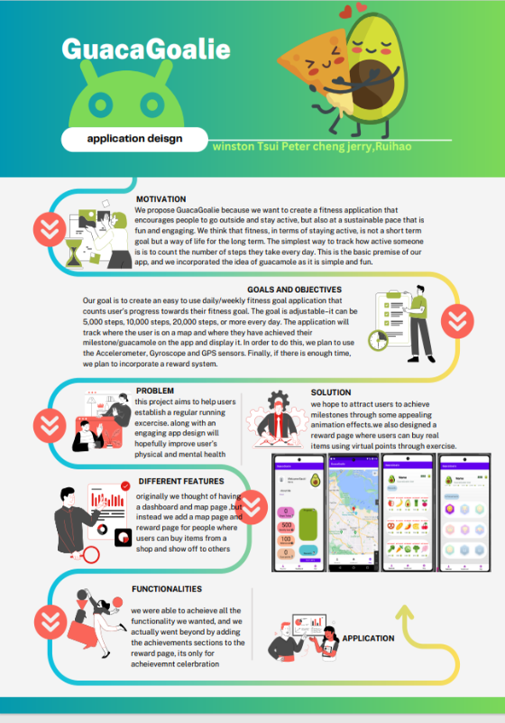
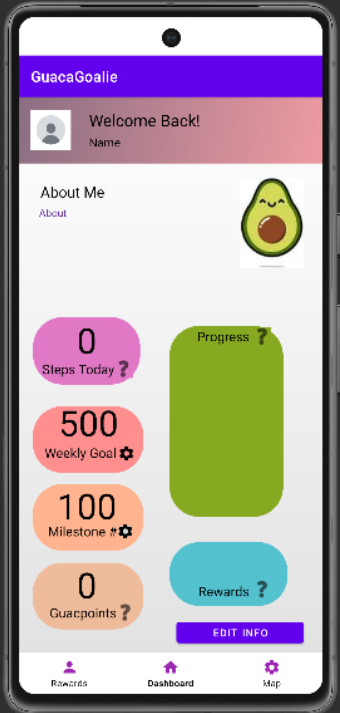
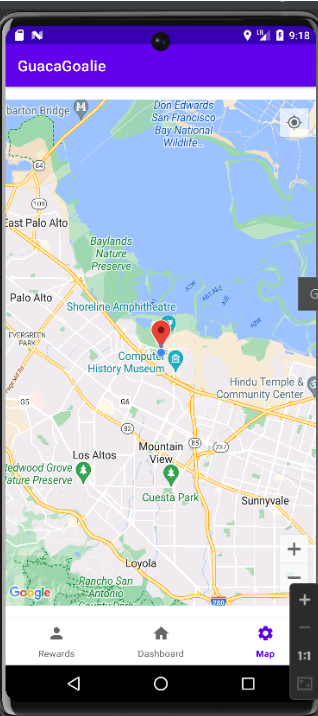
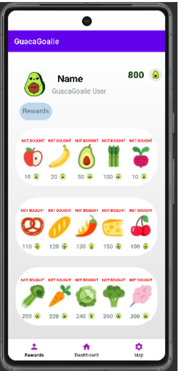
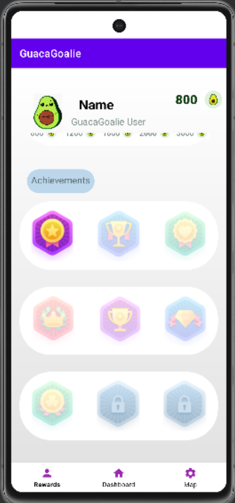

# 🥑 GuacaGoalie – Your Daily Fitness Companion

**GuacaGoalie** is an Android app built with **Kotlin** in **Android Studio**, designed to gamify daily exercise and keep users active and motivated. By combining **Google Maps**, **step tracking**, and a fun point-reward system called **Guaca Points**, users can build healthy habits while unlocking achievements and shopping for virtual goodies.

---
### The Idea


# 🥑 GuacaGoalie – Your Daily Fitness Companion

**GuacaGoalie** is an Android app built with **Kotlin** in **Android Studio**, designed to gamify daily exercise and keep users active and motivated. By combining **Google Maps**, **step tracking**, and a fun point-reward system called **Guaca Points**, users can build healthy habits while unlocking achievements and shopping for virtual goodies.

---

## 📱 Features

- 🚶 **Step Counter Integration** to track user activity
- 📍 **Google Maps API** for location-based fitness interactions
- 🥇 **Milestone & Goal Tracking**
  - Set & update **weekly step goals**
  - Earn **Guaca Points** for hitting milestones
- 🗺️ **Map Page** to visualize milestone achievements
  - **Red marks** on the map show where you achieved milestones
- 🛒 **In-App Store**
  - Spend points to buy fun digital items
- 🧍 **Profile Management**
  - Edit name, about section, goals, and milestones
- 🎉 **Achievements System**
  - Unlock badges as you progress
- 🔔 Friendly reminders and motivational messages to keep moving

---

## 🛠️ Tech Stack

- **Language**: Kotlin  
- **IDE**: Android Studio  
- **APIs**:  
  - [Google Maps API](https://developers.google.com/maps)  
  - Android Step Counter / Sensor APIs  
- **Data Storage**: Local database (Room/SQLite or SharedPreferences)

---

## 🖼️ Screenshots

### 🥾 Milestones Tracker


### 🗺️ Milestone Map



### 🛒 Guaca Store


### 🏆 Achievements Unlocked



---

## 🚀 How to Run

1. **Clone the Repository**

```bash
git clone https://github.com/yourusername/GuacaGoalie.git


Open in Android Studio

Launch Android Studio

Open the project directory

Sync Gradle files and let it download dependencies

Set Up API Keys

Add your Google Maps API key in local.properties or manifest file as needed

MAPS_API_KEY=your_api_key_here
Run the App

Connect a physical Android device or start an emulator

Press ▶️ "Run" in Android Studio

📂 Project Structure
swift
Copy
Edit
GuacaGoalie/
│
├── app/
│   ├── src/
│   │   ├── main/
│   │   │   ├── java/com/example/guacagoalie/
│   │   │   ├── res/layout/
│   │   │   └── AndroidManifest.xml
├── build.gradle
└── README.md


🔒 Permissions
GuacaGoalie requires the following permissions:

ACTIVITY_RECOGNITION – for step tracking

ACCESS_FINE_LOCATION – for Google Maps functionality

INTERNET – for any API-related features

📌 Notes
Guaca Points are virtual and meant for motivational use only.

Store and achievement items are configurable and extendable via the app's data model.

🤝 Contributing
Got a fun idea for a new badge or store item? Feel free to fork the repo, make a change, and send a pull request!


### About us :)
We are Computer Science students at Syracuse University.

Ruihao Zhang
Jerry Li
Peter Cheng
Winston Tsui
